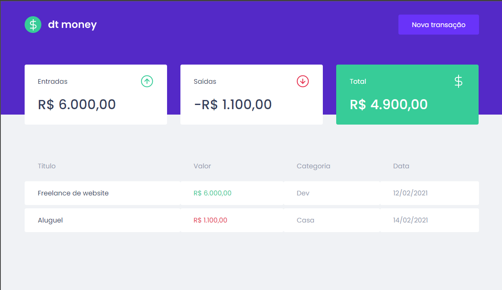

> In this module we will build a complete web front-end application using important concepts and tools
from the React ecosystem such as Styled Components, MirageJS, Context API, hooks, Axios and much more.

* first run ```yarn install```
to install the dependencies

* to run the application, ```yarn start```

###technologies used
* axios
* miragejs
* polished
* styled-components

## preview

